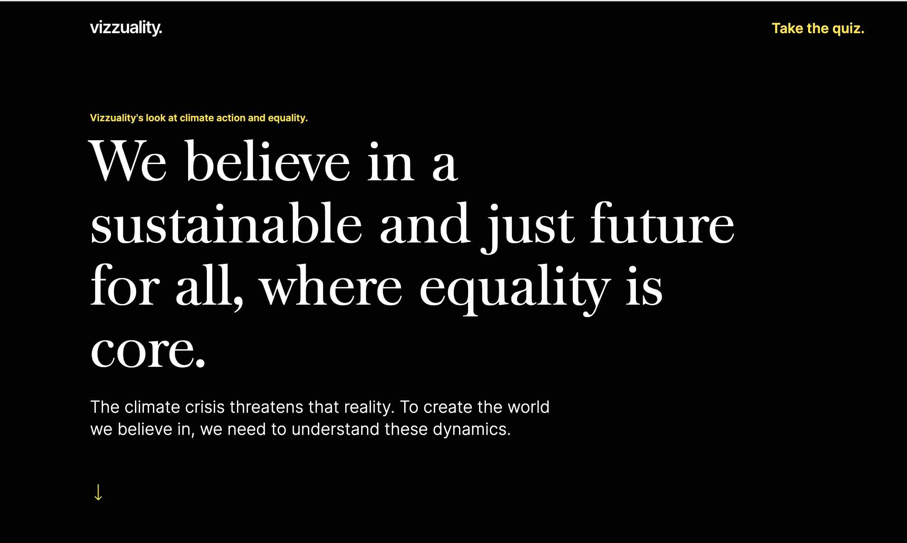

# Climate Inequality



Vizzuality’s look at climate action and equality calls attention to the importance of social and climate justice. The website includes a quiz on inequality and various datasets and analyses that explore the intersectionality of climate and social inequalities. The website aims to promote a comprehensive understanding of the issue and diverse solutions, including improved governance, fairer wealth distribution, company-led solutions on ESG, and adaptation of cultural norms. The ultimate goal is to bring vulnerable and marginalized groups into the conversation and develop initiatives that put people and the planet at the center while driving sustainable and balanced development.

## Stack

- Based on [Next.js](https://nextjs.org/)
- [Tailwind](https://tailwindcss.com/) as CSS Framework
- Reusable components such as forms, modals, icons, and other most use components
- [Typescript](https://www.typescriptlang.org/) already configured
- [Cypress](https://www.cypress.io/) as testing client
- git workflow and hooks
- editorconfig and code style based on [Airbnb](https://github.com/airbnb/javascript)
- [Storybook](https://storybook.js.org/) also available and configured

### Quick start

First, run the development server:

```bash
yarn dev
```

Open [http://localhost:3000](http://localhost:3000) with your browser to see the result.

## Contribution rules

Please, **create a PR** for any improvement or feature you want to add. Try to not commit directly anything on the `main` branch.

## Vulnerability mitigation

[Dependabot's vulnerability security alerts](https://docs.github.com/en/code-security/dependabot/dependabot-alerts/about-dependabot-alerts) are configured in this repository and are displayed to the administrators.

When vulnerabilities are detected, a warning message is displayed at the top of the repository. The list of alerts can be found in the Dependabot alerts page.

Here's a step by step guide on how to address vulnerabilities found in production code:

1. Go to the Dependabot alerts page and locate the front-end vulnerability to address
2. Identify if the vulnerability affects production code:
   - To do so run `yarn npm audit --recursive --environment production`
   - If the dependency is _not_ listed by this command, then the vulnerability only affects development code. You can dismiss the alert on GitHub as “Vulnerable code is not actually used” in the top right corner of the vulnerability page.
   - If the dependency _is_ listed, follow the steps below.
3. On the vulnerability page, click the “Create Dependabot security update” button
   - This will create a Pull Request with a fix for the vulnerability. If GitHub can generate this PR, then you can merge and the security alert will disappear.
   - If the vulnerability can't be patched automatically, follow the steps below.
4. If the action fails, then you can semi-automatically update the vulnerable dependency by running `npm_config_yes=true npx yarn-audit-fix --only prod`
   - `yarn-audit-fix` (see [repository](https://github.com/antongolub/yarn-audit-fix)) is a tool that applies the fixes from `npm audit fix` to Yarn installations
   - The tool might also not be able to fix the vulnerability. If so, continue with the steps below.
5. If the action fails, then you will have to manually update the dependencies until the vulnerability is solved
